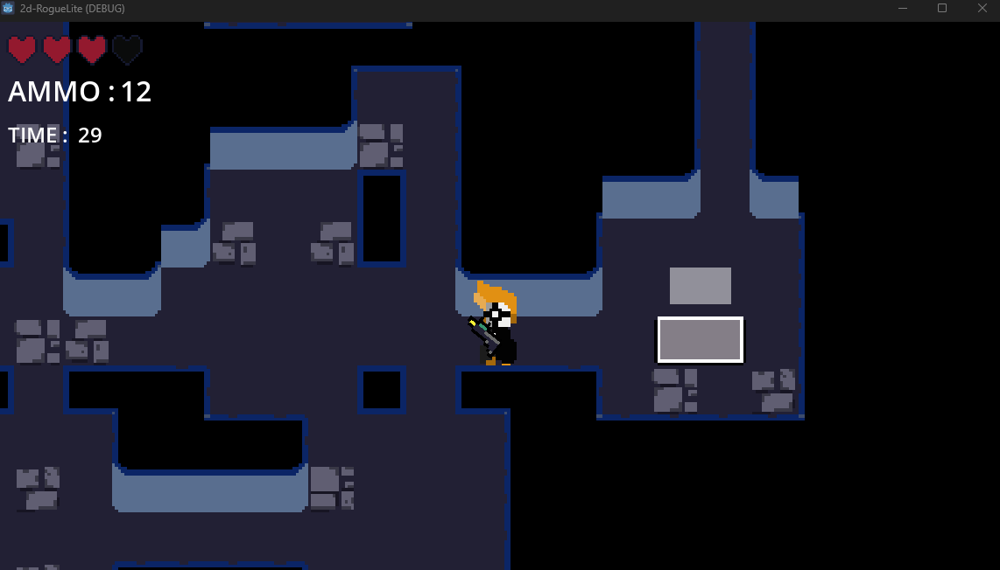

# 2D-RogueLite

## Overview

A first dabble into the world of Godot 4 Engine and creating games.

This RogueLite games highlights some random generation in the form of level generation. There are movement, shooting, enemy AI features also.

To create some Game Juice as the terminology goes, screen shakes and particle effects were added to enhance game feel.

